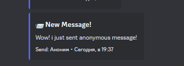
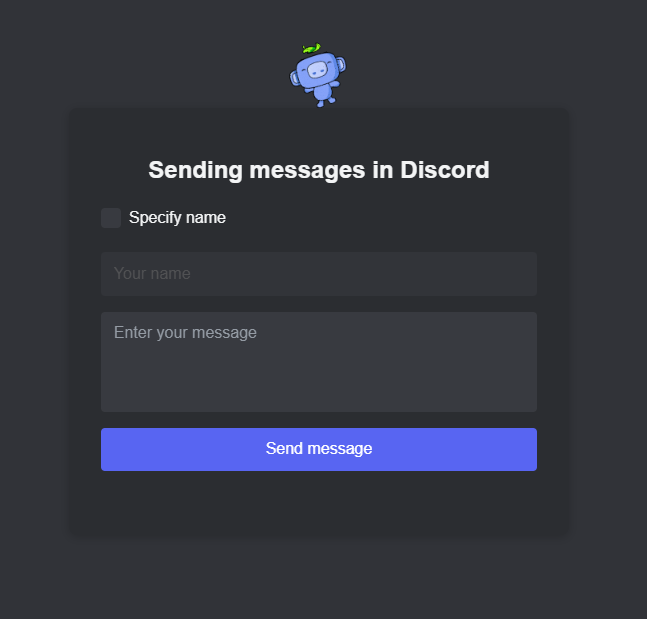

# Discord AnonMessage

**Description**:  
A simple tool to send anonymous messages to a Discord channel using webhooks. The bot allows users to send messages without revealing their identity, making it perfect for anonymous feedback or confessions.

**How to Set Up Webhooks**:  
To make the webhooks work, you need to go to the **JS** folder and open the `discord.js` file. There, locate the following line of code:  
`const WEBHOOK_URL = 'Add Your webhook there!`;

**Features**:  
- Send anonymous messages to a Discord server using webhooks.  
- Option to include a custom name with the message, maintaining anonymity while adding a personal touch.  
- Easy integration with Discord channels via webhook configuration.  
- Supports message customization with different formats.

**How It Works**:  
1. Set up the webhook URL for your Discord channel.  
2. Send an anonymous message through the bot.  
3. Optionally, add a name to the message for a more personalized experience.

**Screenshots**:  

1. Anonymous Message

2. Message with Name

3. Website

